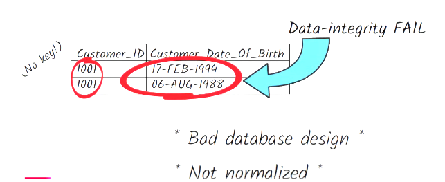
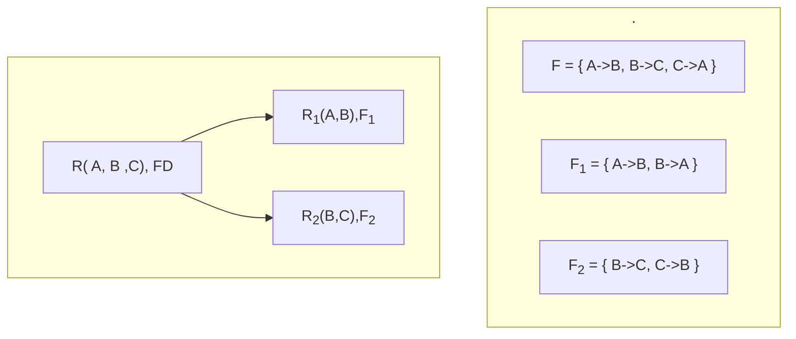

# IITM-DBMS

Database Management System

# Database normalization?

What is normalization? Why do we do it? How do we do it? And what bad things can happen if we don’t do it? Let’s explore database normalization from a practical perspective. We’ll keep the jargon to a minimum, and we’ll use lots of examples as we go.

**Disclaimer:** I am taking reference from a very well made Youtube video titled [Learn Database Normalization - 1NF, 2NF, 3NF, 4NF, 5NF](https://www.youtube.com/watch?v=GFQaEYEc8_8) by [Decomplexify](https://www.youtube.com/@decomplexify) as well as from my IITM BS degree subject DBMS taught by course faculty Dr. Partha Pratim Das. The content of this write up is a mix of transcript from the youtube video and concepts from IITM BS Degree. Also concepts I gathered from live classes available for this Degree. Recording of live classes are also referred to revisit some concepts with some simpler approach

## Goal:

Practically Understand Database Normalization once and for all to be able to implement a good database design in real life.

By the end of it, we will understand the normal forms from the First Normal Form all the way up to Fifth Normal Form and have a clear sense of what we gain by doing normalization, and what we lose by failing to do it.

## Introduction

By and large, even a good database design can’t protect
against bad data.But there are some cases of bad data that a good database design can protect against. These are cases where the data is telling us something that logically cannot possibly be true:One customer with two dates of birth is logically impossible. It’s what we might call a failure of data integrity.

The data can’t be trusted because it disagrees with itself.When data disagrees with itself, that’s more than just a problem of bad data.It’s a problem of bad database design.

Specifically, it’s what happens when a database design isn’t properly normalized.So what does normalization mean?

To understand the normal forms and normalizations in more depth, we have to first understand or rather equip ourselves with certain concepts what causes **data redundancy** and **anomaly**, **functional** **dependency**, **closures**, **candidate key**, **super key**. Once we are thorough with these keeping in mind the practical implications/usage of these concepts we will not only have a strong foundation but the house will be almost complete.

## What are the dangers that redundant data could bring to the table?

### Anomaly

Data redundancy is simply the repetition of data in the table. Data redundancy leads to Anomaly. Goal of normalization is to eliminate redundancy and these undesirable Anomaly. Let's understand what are Anomalies. There are three types of anomalies:

- Insertion Anomaly
- Deletion Anomaly
- Update Anomaly

Let us consider this relation / table showing Suppliers of some machine parts with $Primary key: (SID, PID)$

#### UPDATE ANOMALY
___

Suppose you want to update the city of supplier $S1$. Because of repetitions of the data $S1$ is available in multiple rows. It might happen that update missed out for one or two or some rows due to some technical/manual/logic issue and we end up with conflicting data. This is called **update Anomaly**

#### DELETION ANOMALY
___

Suppose you delete **PID P1**. It will lead to complete loss of data for supplier with **SID S3** . This is called **deletion Anomaly**

#### INSERTION ANOMALY
___
Suppose you want to we want to add to the table a new row. We have a supplier **(S5, 45, Chennai, \_ \_ , 100)**. This is not possible as **QID** is required for the primary key. This is called **Insertion Anomaly**

We will see how these are tackled with some more examples while discussing Normal forms.

So, we saw that data redundancy leads to Anomaly. But...

## What Causes data redundancy?

Whenever there is dependency amongst the attributes it results in data redundancy. Will understand this when we understand the concept of functional dependency.

### Functional Dependency (FD)

In a relation if there are attributes $\alpha$ and $\beta$, with tuples $T$ where $T_i[\alpha] = T_j[\alpha]$, then

if $T_i[\beta] = T_j[\beta]$

we say $\alpha$ determines (functionally determines) $\beta$ (written as $\alpha \rightarrow \beta$)

This will be clear when we refer to the table below. $\alpha$ value of 100 will always determine $\beta$ police. So we can say $\alpha \rightarrow  \beta$

|        | $\alpha$ |   $\beta$   |
| :-----: | :--------: | :-----------: |
| $T_1$ |  $100$  |  $police$  |
| $T_2$ |  $101$  |   $fire$   |
| $T_3$ |  $102$  | $ambulance$ |
| $T_4$ |  $100$  |  $police$  |

There are some rules associated with functional dependency

#### Armstrong's Axioms/ Inference rules

---

##### PRIMARY RULES

  1. **Reflexivity:** if $\beta \subseteq \alpha$ then $\alpha \rightarrow \beta$.

     > Example:
     >
     > $lecture \subseteq  \lbrace student_-id, lecture \rbrace$
     >
     > $\lbrace student_-id, lecture\rbrace \rightarrow lecture$
     >
  2. **Augmentation:** if $\alpha \rightarrow \beta$ then $\gamma\alpha  \rightarrow \gamma\beta$.

     > Example:
     >
     > $student_-id \rightarrow lecture$
     >
     > $\lbrace semester, student_-id \rbrace \rightarrow \lbrace semester, lecture \rbrace$
     >
  3. **transitivity:** if $\alpha \rightarrow \beta, \beta \rightarrow \gamma$, then $\alpha  \rightarrow \gamma$.

     > Example:
     >
     > $student_-id \rightarrow lecture$,
     >
     > $lecture \rightarrow semester$
     >
     > then,
     >
     > $student_-id \rightarrow semester$
     >

---

##### Secondary Rules ( Additional derived rules )

  1. **Union:** if $\alpha \rightarrow \beta$ holds and $\alpha \rightarrow \gamma$ holds  then $\alpha \rightarrow \beta\gamma$ holds.

     > Example:
     >
     > $student_-id \rightarrow lecture$ and $student_-id \rightarrow semester$
     >
     > So, $student_-id\rightarrow \lbrace lecture, semester \rbrace$
     >
  2. **Decomposition:** if $\alpha \rightarrow \beta\gamma$ holds then $\alpha \rightarrow \beta$ holds and $\alpha \rightarrow \gamma$ holds

     > Example:
     >
     > $student_-id\rightarrow \lbrace lecture, semester \rbrace$
     >
     > So,  $student_-id \rightarrow lecture$ and $student_-id \rightarrow semester$

  3. **Pseudo transitivity:** if $\alpha \rightarrow \beta, \beta\gamma \rightarrow \delta$, then $\alpha\gamma  \rightarrow \delta$.

     > Example:
     >
     > if $student_-id \rightarrow lecture$,
     >
     > and $\lbrace lecture, TA \rbrace \rightarrow semester$
     >
     > then,
     >
     > $\lbrace student_-id,TA \rbrace \rightarrow semester$
     >

---
#### Closure of a Set of FD:  $(F)^+$
Closure of a set of Functional Dependency means the complete set of all possible attributes that can be functionally derived from a given functional dependency. The closer set of $F$ is denoted by $F^+$

Example:

Consider a relation $R(A,B,C,G,H)$ and

FD set $FD = \lbrace A\rightarrow H, GC\rightarrow B, CH\rightarrow B  \rbrace$

Let's compute the closure set $(AC)^+$

$$
\begin{align}
(AC)^+ &= (AC)^+ \\
       &= (ACH)^+ \cdots since\space A \rightarrow H \\
       &= (ACHB)^+ \cdots since\space CH \rightarrow B  \\
\end{align}
$$

## Candidate Key and Super Key

### Candidate Key
A Candidate key is a set of minimal attributes that can uniquely identify a tuple in a relationship. These keys have potential to become a primary key (which uniquely identifies a tuple in the relationship). Thus the name "candidate key". Each candidate key is a super key but the reverse is not true.

Example:

$R(A,B,C,G,H), FD = \lbrace A \rightarrow H, GC \rightarrow A \rbrace$

> Tips: to find candidate keys, first take those attribute that are not in the RHS of the FDs.

$$
\begin{align}
(BCG)^+ &= (BCG)^+ \\
        &= (BCGA)^+ \\
        &= (BCGAH)^+ \\
        &= (ABCGH)^+ \\
        \\
(BC)^+ &= (BC)^+ \\
       &\not=(ABCGH) \\
        \\
(CG)^+ &= (CG)^+ \\
       &= (CGA)^+ \\
       &= (CGAH)^+ \\
       &\not=(ABCGH)
\end{align}
$$

so, the only candidate key in the above case is $(BCG)$

### Super Key
A superset of any candidate key is a super key.

So in the above example, after we find the candidate key, we can take any superset of it to arrive at the super key

## Normalization
Let us look back at the example we have seen before:

When you normalize a database table,you structure it in such a way that it can't express redundant information.So, for example, in a normalized table, you wouldn’t be able to give Customer 1001 two dates of birth even if you wanted to.Normalized database tables are not only protected from contradictory data, they’re also easier to understand easier to enhance and extend protected from insertion anomalies, update anomalies,and deletion anomalies.

How do we determine whether a table isn’t normalized enough – in other words, how do we determine if there’s a danger that redundant data could creep into the table? Well, it turns out that there are sets of criteria we can use to assess the level of danger. These sets of criteria have names like “first normal form”, “second normal form”, “third normal form”, and so on.

If we discover that a table meets the requirements of the first normal form, that’s a bare minimum safety guarantee. If we further discover that the table meets the requirements of the second normal form, that’s an even greater safety guarantee. And so on. Meeting each normal form provides a higher guarantee against data redundancy and anomaly.

We have previously learnt that
> $DEPENDENCY$ leads to $REDUNDANCY$
>
> $REDUNDANCY$ leads to $ANOMALY$

$NORMALIZATION$ or $Schema\space Refinement$ is a technique of organizing the data in the database. This is done through a systematic approach of decomposing (Good Decomposition) Tables to eliminate data Redundancy and anomaly.

So,
> $NORMALIZATION$ is achieved through $GOOD\space  DECOMPOSITION$
>
> $GOOD\space DECOMPOSITION$ minimizes $DEPENDENCY$
>
> Minimized $DEPENDENCY$ leads to minimizing $REDUNDANCY$
>
> Minimized $REDUNDANCY$ leads to minimizing $ANOMALY$

Most common technique for normalization is decomposition. Keep in mind that not all decomposition is "Good Decomposition"

### Good Decomposition

A decomposition of a table or relation is said to good decomposition if it is :

1. Lossless join Decomposition
2. Dependency Preserving

#### Lossless Join Decomposition
___
If a relation $R$ is decomposed into two relations $R_1$ and $R_2$ then it is said to be a lossless decomposition if:

   1. $R_1 \bigcup R_2 = R$ (natural join should give us original table)
   2. $R_1 \bigcap R_2 \not= \phi$
   3. $R_1 \bigcap R_2$ should be key to either $R_1$ or $R_2$ i.e. $R_1 \bigcap R_2 \rightarrow R_1\space or\space R_2$

#### Dependency Preserving
___

Suppose there's a functional dependency set $FD$ for the relation $R$ and $F_1$ and $F_2$ dependencies for $R_1$ and $R_2$ respectively, then we should get the original $FD$ by combining $F_1$ and $F_2$

- $F^+ \subseteq (F_1 \bigcup F_2)^+$

Example:

Let's check if the above decomposition is lossless
> $R_1 \bigcup R_2 = R$,
>
> $R_1 \bigcap R_2 \not= \phi$
>
> $R_1 \bigcap R_2 = B$ which is a key either $R_1$ or $R_2$

So the decomposition is lossless

Now let's check if the decomposition is dependency preserving

> $F =\lbrace A\rightarrow B, B\rightarrow C, C\rightarrow A \rbrace, F^+ = (ABC)^+$
>
> $F_1=\lbrace A\rightarrow B, B\rightarrow A\rbrace, F_1^+ = (AB)^+$
>
> $F_2 =\lbrace B\rightarrow C, C\rightarrow B\rbrace, F_2^+ = (BC)^+$
>
>Also, $(F_1 \bigcup F_2) = \lbrace A\rightarrow B, B\rightarrow A, B\rightarrow C, C\rightarrow B, C\rightarrow A \rbrace$ (using rules)
>
> $(F_1 \bigcup F_2)^+ = (ABC)^+$, so $F^+ \subseteq (F_1 \bigcup F_2)^+$

So, the decomposition is dependency preserving as well. Hence this particular decomposition is a Good Decomposition.

First Normal Form (1NF)

So let’s begin at the beginning, with First Normal Form.Suppose you and I are both confronted by this question:“Who were the members of the Beatles?” You might answer “John, Paul, George, and Ringo”.I might answer “Paul, John, Ringo, and George”. Of course, my answer and your answer are equivalent, despite having the names in a different order.When it comes to relational databases, the same principle applies. Let’s record the names of theBeatles in a table, and then let’s ask the database to return those names back to us.The results will get returned to us in an arbitrary order. For example, they might get returned like this. Or like this.Or in any other order. There is no “right” order. Are there ever situations where there’s a right order? Suppose we write down the members of the Beatles from tallest to shortest,like this. We title our list “Members Of The Beatles From Tallest To Shortest”.In this list, it’s not just the names that convey meaning. The order of the names conveys meaning too. Paul is the tallest, John is the second-tallest, and so on. Lists like this are totally comprehensible to us – but they’re not normalized. Remember, there’s no such thing as roworder within a relational database table. So here we have our first violation of First Normal Form.When we use row order to convey information, we’re violating First Normal Form.The solution is very simple. Be explicit – if we want to capture height information, we should devote a separate column to it – like this. Or even better, like this.So far, we’ve seen one way in which a design can fail to achieveFirst Normal Form. But there are others. A second way of violating First Normal Form Involves mixing data types. Suppose our Beatle_Height dataset looked like this.If you’re accustomed to spreadsheets, you’ll be aware that they typically won’t stop you from having more than one data type within a single column – for example, they won’t stop you from storing both numbers and strings in a column. But in a relational database, you’re not allowed to be cagey or ambiguous about a column’s data type. The values that go in the Height_In_Cm column can't be a mix of integers and strings. Once you define Height_In_Cm as being an integer column,then every value that goes into that column will be an integer – no strings, no timestamps,no data types of any kind other than integers. So: mixing data types within a column is a violation of First Normal Form, and in fact the database platform won’t even let you do it.A third way of violating First Normal Form is by designing a table without a primary key. A primary key is a column, or combination of columns, that uniquely identifies a row in the table.For example, in the table Beatle_Height, our intention is that each row should tellus about one particular Beatle, so we ought to designate “Beatle” as the primary key of theBeatle_Height table. The database platform will need to know about our choice of primary key,so we’ll want to get the primary key into the database by doing something like this.With the primary key in place, the database platform will prevent multiple rows for the same Beatle from ever being inserted. That’s a good thing,because multiple rows for the same Beatle would be nonsensical, and perhaps contradictory.Obviously, a Beatle can’t have two different heights at once.Every table we design should have a primary key. If it doesn’t, it’s not in First Normal Form.The last way of failing to achieve First Normal Form involves the notion of“repeating groups”. Suppose we’re designing a database for an online multiplayer game.At a given time, each player has a number of items of different types, like arrows,shields, and copper coins. We might represent the situation like this.A player’s inventory is what we call a “repeating group”. Each inventory contains potentially many different types of items: arrows, shields, copper coins, and so on; and in fact there may be hundreds of different types of items that a player might have in their inventory.We could design a database table that represents the Inventory as a string of text:But this is a terrible design because there’s no easy way of querying it.For example, if we want to know which players currently have more than 10 copper coins,then having the inventory data lumped together in a text string will make it very impractical to write a query that gives us the answer.We might be tempted to represent the data like this.This lets us record up to 4 items per inventory. But given that a player can have an inventory consisting of hundreds of different types of items, how practical is it going to be to design a table with hundreds of columns? Even if we were to go ahead and create a super-wide table to hold all possible inventory data, querying it would still be extremely awkward.The bottom line is that storing a repeating group of data items on a single row violates FirstNormal Form. So what sort of alternative design would respect First Normal Form?It would be this. To communicate the fact that rev 73 owns 3 shields, we have a row for Player “trev73”, Item_Type “shields”, Item_Quantity 3.To communicate the fact that trev73 also owns 5 arrows,we have a row for Player “trev73”, Item_Type “arrows”, Item_Quantity 5. And so on.And because each row in the table tells us about one unique combination of Playerand Item_Type, the primary key is the combination of Player and Item_Type.So let’s review what we know about First Normal Form.1. Using row order to convey information is not permitted2. mixing data types within the same column is not permitted3. Having a table without a primary key is not permitted4. repeating groups are not permitted Next up: Second Normal Form. Second Normal Form (2NF)

Let’s look again at our Player Inventory table. This table is fully normalized. But suppose we enhance the table slightly. Let’s imagine that every player has a rating: Beginner,Intermediate, or Advanced. We want to record the current rating of each player – and to achieve that, we simply include in our table an extra column called Player_Rating.Notice what’s happening here. Player jdog21 has a Player_Rating of Intermediate,but because jdog21 has two rows in the table, both those rows have to be marked Intermediate.Player trev73 has a Player_Rating of Advanced,but because trev73 has four rows in the table, all four of those rows have to be marked Advanced.This is not a good design. Why not? Well, suppose player gila19 loses all her copper coins,leaving her with nothing in her inventory. The single entry that she did have in thePlayer_Inventory table is now gone. If we try to query the database to find out what gila19’s Player Rating is, we’re out of luck. We can no longer access gila19’s PlayerRating because the database no longer knows it. This problem is known as a deletion anomaly.And that’s not all. Suppose jdog21 improves his rating from Intermediate to Advanced.To capture his new Advanced rating in the Player_Inventory table,we run an update on his two records. But let’s imagine the update goes wrong.By accident, only one of jdog21’s records gets updated, and the other record gets left alone.Now the data looks like this. As far as the database is concerned,jdog21 is somehow both Intermediate and Advanced at the same time.Our table design has left the door open for this type of logical inconsistency.This problem is called an update anomaly. Or suppose a new player called Tina42 comes along.She’s a Beginner and she doesn’t have anything in her inventory yet. We want to record the fact that she’s a Beginner, but because she has nothing in her inventory, we can't insert a tina42 row into the Player_Inventory table. So her rating goes unrecorded. This Problem is known as an insertion anomaly. The reason our design is vulnerable to these problems is that it isn’t in Second Normal Form. Why not? What is Second Normal Form?Second Normal Form is about how a table’s non-key columns relate to the primary key. In our table,the non-key columns – or to use slightly different terminology, non-key attributes – areItem_Quantity and Player_Rating. They are columns (also called attributes)that don’t belong to the primary key. As we saw earlier, the primary key is the combination of Player and Item Type.Now we’re in a position to give a definition of Second Normal Form.The definition we’re going to give is an informal one which leaves out some nuances – but for most practical purposes, that shouldn’t matter.Informally, what Second Normal Form says is that each non-key attribute in the table must be dependent on the entire primary key. How does our table measure up to this definition?Let’s examine our non-key attributes, which are the attributes Item_Quantity and Player_Rating.Does Item_Quantity depend on the entire primary key? Yes, because an Item_Quantity is about a specific Item_Type owned by a specific Player. We can express it like this.The arrow signifies a dependency – or to give it its proper name, a functional dependency.This simply means that each value of the thing on the left side of the arrow is associated with exactly one value of the thing on the right side of the arrow. Each combination of Player_ID andItem_Type is associated with a specific value of Item_Quantity – for example the combination of Player_ID jdog21 / Item_Type “amulets” is associated with an Item_Quantity of 2.As far as Second Normal Form is concerned, this dependency is fine,because it’s a dependency on the entire primary key. But what about the other dependency?Does Player_Rating depend on the entire primary key? No, it doesn’t. Player_Rating is a property of the Player only. In other words, for any given Player, there’s one Player_Rating.This dependency on Player is the problem. It’s a problem because Player isn’t the primary key – Player is part of the primary key, but it’s not the whole key.That’s why the table isn’t in Second Normal Form, and that’s why it’s vulnerable to problems.At what point did our design go wrong, and how can we fix it? The design went wrong when we chose to add a Player_Rating column to a table where it didn’t really belong.The fact that a Player_Rating is a property of a Player should have helped us to realize that a Player is an important concept in its own right – so surely Player deserves its own table:Nothing could be simpler than that. A Player table will contain one row per Player,and in it we can include as columns the ID of the player, the rating of the player, as well as all sorts of other properties of the player – maybe the player’s date of birth, for example,maybe the player’s email address. Our other table, Player_Inventory, can stay as it was.For both tables, we can say that there are no part-key dependencies.In other words, it’s always the case that every attribute depends on the whole primary key,not just part of it. And so our tables are in Second Normal Form.Now let’s move on to Third Normal Form. Suppose we decide to enhance the Player table. Third Normal Form (3NF)

We decide to add a new column called Player_Skill_Level.Imagine that in this particular multiplayer game, there’s a nine-point scale for skill level.At one extreme, a player with skill level 1 is an absolute beginner;at the opposite extreme, a player with skill level 9 is as skilful as it’s possible to be.And let’s say that we’ve defined exactly how Player Skill Levels relate to Player Ratings.“Beginner” means a skill level between 1 and 3. “Intermediate” means a skill level between 4 and 6. And “Advanced” means a skill level between 7 and 9.But now that both the Player_Rating and the Player_Skill_Level exist in the Player table,a problem can arise. Let’s say that tomorrow, player gila19’s skill level increases from 3 to 4. If that happens, we’ll update her row in the Player table to reflect this new skill level.By rights, we should also update her Player_Rating to Intermediate – but suppose something goes wrong, and we fail to update the Player_Rating. Now we’ve got a data inconsistency. gila19’sPlayer_Rating says she’s a Beginner, but her Player_Skill_Level implies she’s Intermediate.How did the design allow this happen? Second Normal Form didn’t flag up any problems. There’sno attribute here that depends only partially on the primary key – as a matter of fact,the primary key doesn’t have any parts; it’s just a single attribute. And both Player_Ratingand Player_Skill_Level are dependent on it. But in what way are they dependent on it? Let's Look more closely. Player_Skill_Level is dependent on Player_ID.Player_Rating is dependent on Player ID too, but only indirectly – like this.A dependency of this kind is called a transitive dependency. Player Rating depends on Player SkillLevel which in turn depends on the primary key: Player ID. The problem is located just here – because what Third Normal Form forbids is exactly this type of dependency: the dependency of a non-key attribute on another non-key attribute. Because Player Rating depends on Player SkillLevel – which is a non-key attribute – this table is not in Third Normal Form.There’s a very simple way of repairing the design to get it into Third Normal Form.We remove Player Rating from the Player table; so now the Player table looks like this.And we introduce a new table called Player_Skill_Levels.The Player Skill Levels table tells us everything we need to know about how to translate a player skill level into a player rating. Third Normal Form is the culmination of everything we've covered about database normalization so far. It can be summarized in this way: Everynon-key attribute in a table should depend on the key, the whole key, and nothing but the key.If you commit this to memory, and keep it constantly in mind while you’re designing a database, then 99% of the time you will end up with fully normalized tables.It’s even possible to shorten this guideline slightly by knocking out the phrase“non-key” – giving us the revised guideline: every attribute in a table should depend on the key, the whole key, and nothing but the key. And this new guideline represents a slightly stronger flavor ofThird Normal Form known as Boyce-Codd Normal Form. In practice, the difference between Third NormalForm and Boyce-Codd Normal Form is extremely small, and the chances of you ever encountering a real-life Third Normal Form table that doesn’t meet Boyce-Codd Normal Form are almost zero.Any such table would have to have what we call multiple overlapping candidate keys – which gets us into realms of obscurity and theoretical rigor that are a little bit beyond the scope of this video. So as a practical matter, just follow the guideline that every attribute in a table should depend on the key, the whole key, and nothing but the key, and you can be confident that the table will be in both Third Normal Form and Boyce-Codd Normal Form.In almost all cases, once you’ve normalized a table this far, you’ve fully normalized it. There are some instances where this level of normalization isn’t enough.These rare instances are dealt with by Fourth and Fifth Normal Form.So let’s move on to Fourth Normal Form. We’ll look at an example of a situation where Third Fourth Normal Form (4NF)

Normal Form isn’t quite good enough and something a bit stronger is needed. In our example, there's a website called DesignMyBirdhouse.com – the world’s leading supplier of customized birdhouses.On DesignMyBirdhouse.com, customers can choose from different birdhouse models,and, for the model they’ve selected, they can choose both a custom color and a custom style. Each model has its own range of available colors and styles.One way of capturing this information is to put all the possible combinations in a single table, like this. This table is in Third Normal Form. The primary key consists of all three columns: lbraceModel, Color, Stylerbrace. Everything depends on the key,the whole key, and nothing but the key. And yet this table is still vulnerable to problems. Let’s look at the rows for the birdhouse model “Prairie”:The available colors for the “Prairie” birdhouse model are brown and beige.Now suppose DesignMyBirdhouse.com decides to introduce a third available color for the “Prairie” model: green. This will mean we’ll have to add two extra “Prairie” rows to the table:one for green bungalow, and one for green schoolhouse.If by mistake we only add a row for green bungalow, and fail to add the row for green schoolhouse, then we have a data inconsistency. Available colors are supposed to be completely independent of available styles. But our table is saying that a customer can choose green only for the bungalow style, not for the schoolhouse style. That makes no sense.The prairie birdhouse model is available in green, so all its styles should be available in green.Something about the way the table is designed has allowed us to represent an impossible situation.To see what’s gone wrong, let’s have a closer look at the dependencies among Models,Colors, and styles. Can we say that Color has a functional dependency on Model?Actually no, because a specific Model isn’t associated with just one Color.And yet it does feel as though Color has some relationship to Model. How can we express it?We can say that each Model has a specific set of available Colors. This kind of dependency is called a multivalued dependency, and we express it with a double-headed arrow, like this:And it’s equally true that each Model has a specific set of available Styles.What Fourth Normal Form says is that the only kinds of multivalued dependency we’re allowed to have in a table are multivalued dependencies on the key. Model is not the key; so the tableModel_Colors_And_Styles_Available is not in Fourth Normal Form.As always, the fix is to split things out into multiple tables.Now, if DesignMyBirdhouse.com expands the range of Prairie-Model colors to include green, we simply add a row to the Model_Colors_Available table: And no anomalies are possible.We’re now ready for Fifth Normal Form, the last normal form covered in this video. Fifth Normal Form (5NF)

For our Fifth Normal Form example, we imagine that there are three different brands of ice cream available: Frosty’s, Alpine, and Ice Queen. Each of the three brands of ice cream offers a different range of flavors: Frosty’s offers vanilla, chocolate,strawberry, and mint chocolate chip Alpine offers vanilla and rum raisinIce Queen offers vanilla, strawberry, and mint chocolate chipNow we ask our friend Jason what types of ice cream he likes.Jason says: I only like vanilla and chocolate. And I only like the brands Frosty and Alpine.We ask our other friend, Suzy, what types of ice cream she likes. Suzy says: I only like rum raisin, mint chocolate chip, and strawberry. And I only like the brands Alpine and Ice Queen.So, after a little bit of brainwork, we deduce exactly which ice cream productsJason and Suzy are willing to eat; and we express this in a table:But time passes, tastes change, and at some point Suzy announces that she now likes Frosty’s brandice cream too. So we need to update our table. It won’t come as any surprise that we might get this update wrong. We might successfully add a row for Person Suzy – Brand Frosty’s – FlavorStrawberry, but fail to add a row for Person Suzy – Brand Frosty’s – Flavor Mint Chocolate Chip.And this outcome wouldn’t just be wrong – it would be logically inconsistent – because we've already established that Suzy likes Frosty’s brand, and likes Mint Chocolate Chip flavor,and therefore there’s no way she can dislike Frosty’s Mint Chocolate Chip.In this example, we went wrong right at the beginning. At the beginning, we were given three pieces of information. First, we were told which brands offered which flavors. Second, we were told which people liked which brands. Third, we were told which people liked which flavors.From those three pieces of information, we should have simply created three tables.And that’s all we needed to do. All the facts of the situation have been represented.If we ever want to know what specific products everyone likes,we can simply ask the database platform, expressing our question in the form of apiece of SQL that logically deduces the answer by joining the tables together.To sum things up: if we want to ensure that a table that’s in Fourth NormalForm is also in Fifth Normal Form, we need to ask ourselves whether the table can be logically thought of as being the result of joining some other tables together.If it can be thought of that way, then it’s not in Fifth Normal Form.If it can’t be thought of that way, then it is in Fifth Normal Form. Summary and review

We’ve now covered all the normal forms from First Normal Form to Fifth Normal Form. Let’s review,keeping in mind that for a table to comply with a particular normal form, it must comply with the lower normal forms as well. The rules for the first normal form are:1. Using row order to convey information is not permitted2. mixing data types within the same column is not permitted3. Having a table without a primary key is not permitted4. repeating groups are not permitted The rule for second normal form is:Each non-key attribute in the table must be dependent on the entire primary key.The rule for third normal form is: Each non-key attribute in a table must depend on the key,the whole key, and nothing but the key. If we prefer to drop the phrase “non-key”, we end up with an even simpler and even stronger version of third normal form called “Boyce-Codd Normal Form”:Each attribute in a table must depend on the key, the whole key, and nothing but the key.The rule for fourth normal form is that the only kinds of multivalued dependency we're allowed to have in a table are multivalued dependencies on the key.Finally, the rule for Fifth Normal Form is: it must not be possible to describe the table as being the logical result of joining some other tables together.I hope you’ve found this video helpful. If you have any comments or questions on what you’ve just seen, by all means put them in the comments section below.And if you have any suggestions for other complex topics that you’d like to see explained on Decomplexify, again let me know in the comments. So long, and thanks for watching!

$$

$$
